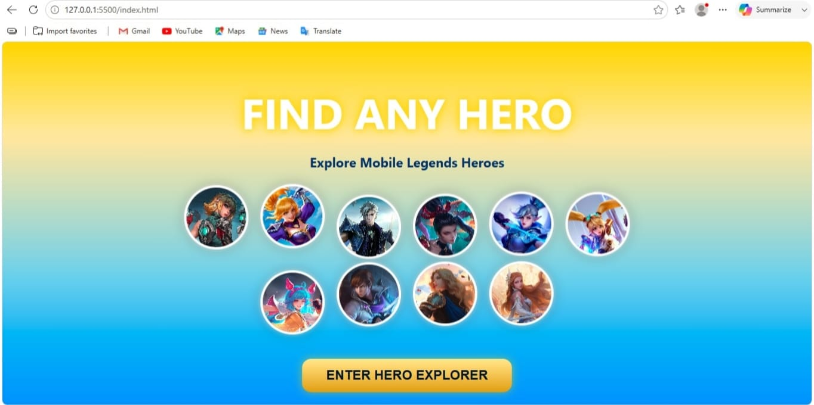
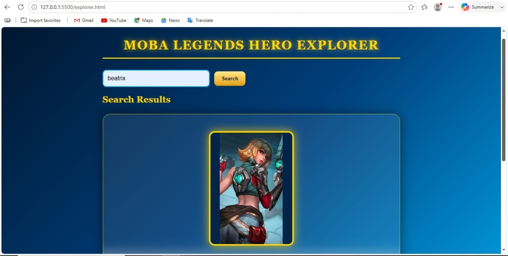
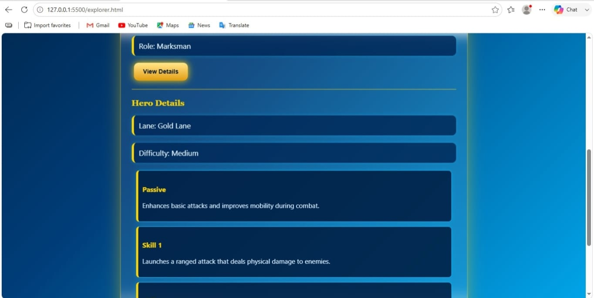

Mobile Legends Hero Explorer

This is a simple web project made using HTML, CSS, JavaScript, and JSON.

The project allows users to search for a Mobile Legends hero by name. After searching, it displays the hero's image and basic information. Users can also click on **View Details** to see the hero's lane, difficulty, and skills.


## Features

- Search hero by name
- Display hero image
- Show hero role
- View hero lane
- Show hero difficulty
- Display all hero skills
- Hero data stored in a JSON file
- Shows **"Hero not found"** if the hero is not available

## Technologies Used

- HTML
- CSS
- JavaScript
- JSON


## Concepts Used

- DOM Manipulation
- Event Listeners
- Functions
- Arrays
- Array `find()` Method
- Array `forEach()` Method
- Fetch API
- Async/Await
- Conditional Statements (`if`)
- Error Handling (`try...catch`)
- CSS Flexbox
- CSS Animations


## Project Structure

```
ML-Hero-Explorer/
│
├── index.html
├── explorer.html
├── landing.css
├── style.css
├── script.js
├── heroes.json
├── images/
└── README.md
 ```
## How to Use

1. Open `index.html`.
2. Click **Enter Hero Explorer**.
3. Type the hero name in the search box.
4. Click **Search**.
5. Click **View Details** to see the hero's lane, difficulty, and skills.


## Error Handling

- If the searched hero is not found, the application displays **"Hero not found"**.
- The project uses `try...catch` while loading the JSON file.
- The **View Details** button works only after a hero is searched.


## What I Learned

While making this project, I learned how to:

- Read data from a JSON file using Fetch API
- Search data using JavaScript
- Update webpage content using DOM Manipulation
- Handle user input
- Use arrays and JavaScript methods
- Handle basic errors
- Design a simple and attractive user interface

## Screenshots

### Landing Page



### Hero Search



### Hero Details




## Author

**Kirti Gadhave**

B.Sc. Computer Science Student